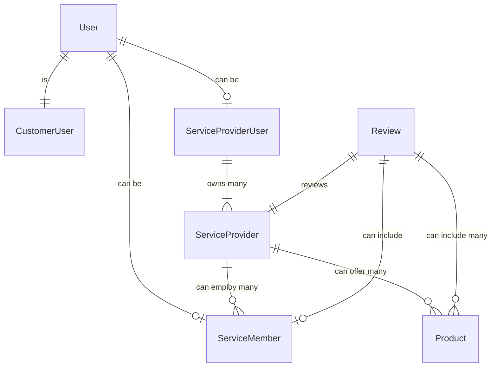

# DingIt
Sources for the DingIt web application

## Schema

```mermaid
erDiagram
    User ||--|| CustomerUser : "is"
    User ||--o| ServiceProviderUser : "can be"
    User ||--o| ServiceMember : "can be"

    ServiceProviderUser ||--|{ ServiceProvider : "owns many"
    ServiceProvider ||--o{ ServiceMember : "can employ many"
    ServiceProvider ||--o{ Product : "can offer many"

    Review ||--|| ServiceProvider : "reviews"
    Review ||--o| ServiceMember : "can include"
    Review ||--o{ Product : "can include many"
```