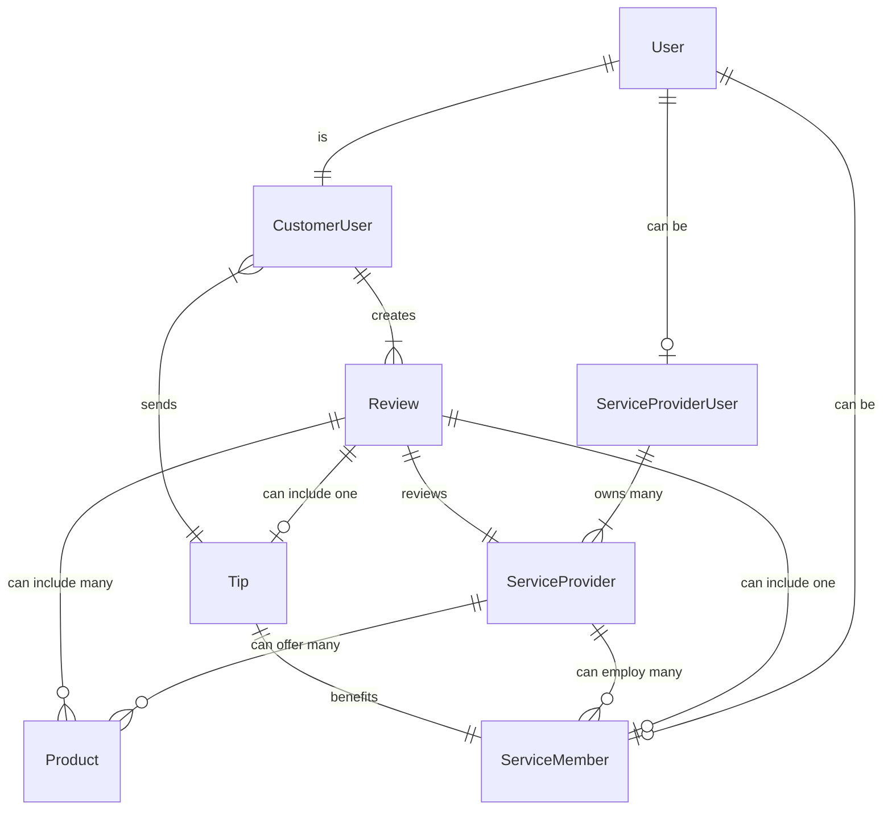

# DingIt
Sources for the DingIt web application

## Schema

```mermaid
erDiagram
    User ||--|| CustomerUser : "is"
    User ||--o| ServiceProviderUser : "can be"
    User ||--o| ServiceMember : "can be"

    ServiceProviderUser ||--|{ ServiceProvider : "owns many"
    ServiceProvider ||--o{ Product : "can offer many"

    Review ||--|| ServiceProvider : "reviews"
    Review ||--o| ServiceMember : "can include one"
    Review ||--o{ Product : "can include many"
    ServiceProvider ||--o{ ServiceMember : "can employ many"
    Review ||--o| Tip : "can include one"
    CustomerUser ||--|{ Review : "creates"
    CustomerUser }|--|| Tip : "sends"
    Tip ||--|| ServiceMember : "benefits"
```

## Development
```
supabase start
supabase db diff -f <diff_file_title>
```